# 📌 프로젝트 소개

## 무스비 프로젝트

JavaSpring, html, css, JavaScript, redis, mysql, Grok AI를 활용해서 만든 언어교환 웹사이트 입니다.

## 📄 배포사이트

[차후 업데이트 예정](주소입력)

## 🖥️ Repository

[Repo](https://github.com/SMARTCLOUDIT48/Backend)

### 관리자(admin) 계정

```
ID: admin
PW: admin
```

### 프로젝트 기간

2026년 1월 19일 ~ 2026년 3월 5일

## 💁‍♂️ 개발팀원 및 역할

| <a href="https://github.com/whatabae"></a> | <a href="https://github.com/leechanghwi"></a> | <a href="https://github.com/wlvp3907-source"></a> | <a href="https://github.com/ddungddangi"></a> | <a href="https://github.com/cky95-bit"></a> |
| :------------------------------------------------------------------------------------------------------------------------------------: | :---------------------------------------------------------------------------------------------------------------------------------------: | :-------------------------------------------------------------------------------------------------------------------------------------------: | :---------------------------------------------------------------------------------------------------------------------------------------: | :-------------------------------------------------------------------------------------------------------------------------------------: |
|                                                 [김한식](https://github.com/whatabae)                                                  |                                                 [이창휘](https://github.com/leechanghwi)                                                  |                                                 [최민석](https://github.com/wlvp3907-source)                                                  |                                                 [최동욱](https://github.com/ddungddangi)                                                  |                                                 [최근영](https://github.com/cky95-bit)                                                  |
|                                                        검색 / 매칭 페이지 구현                                                         |                                                          인증 / 인가 페이지 구현                                                          |                                                            Main / Q&A / ADMIN 구현                                                            |                                                             채팅 페이지 구현                                                              |                                                          커뮤니티 페이지 구현                                                           |

## 📌 Stack

Backend  


Frontend  


Database  


AI  


Development Environment  


Version Control  


Collaboration Tools  


## 📌 담당 기능

### 👤 이창휘 (인증 / 회원 기능)

- 회원가입
- 로그인
- 로그아웃
- 관심사 등록
- 마이페이지
- 개인정보 수정
- 내 프로필을 본 사람
- 내 프로필을 좋아요한 사람
- 관심사 기반 친구 추천
- 마이페이지 현재 대화중인 이성 수 조회

---

### 👤 김한식 (검색, 매칭 시스템)

- 파트너 추천 페이지 구현
- 사용자 매칭 기능
- 파트너 추천 알고리즘 구현
- Redis 매칭 큐 관리

---

### 👤 최근영 (커뮤니티)

- 게시판 구현
- 피드 구현
- 게시글 작성 / 수정 / 삭제
- 댓글 기능
- 좋아요 기능
- 유저 프로필
- 유저 작성글 목록
- 매너온도 반영
- 대화중인 이성 수 표시

---

### 👤 최동욱 (채팅)

- 실시간 채팅 기능
- 채팅방 생성 및 관리
- 채팅 메시지 저장
- 파일 전송 기능
- AI를 활용한 자동 응답 기능
- 사용자가 입력한 메시지에 대해 AI가 답변을 생성하여 채팅에 표시
- 채팅 서버에서 AI API를 호출하여 응답 생성
- AI 기반 맞춤법 교정 기능
- AI 번역 기능 (다국어 번역 지원)
- AI 음성 생성 기능 (텍스트를 음성으로 변환)
- 음성 녹음 기능

---

### 👤 최민석 (Main / Q&A / 관리자)

- 메인페이지
- 문의(Q&A) 등록
- 관리자 문의 관리
- 관리자 대시보드
- 사용자 관리
- 게시글 관리

## 프로젝트 미리보기

## 📌 구현 페이지와 주요 기능

### 👤 이창휘 (인증 / 회원)

#### 로그인

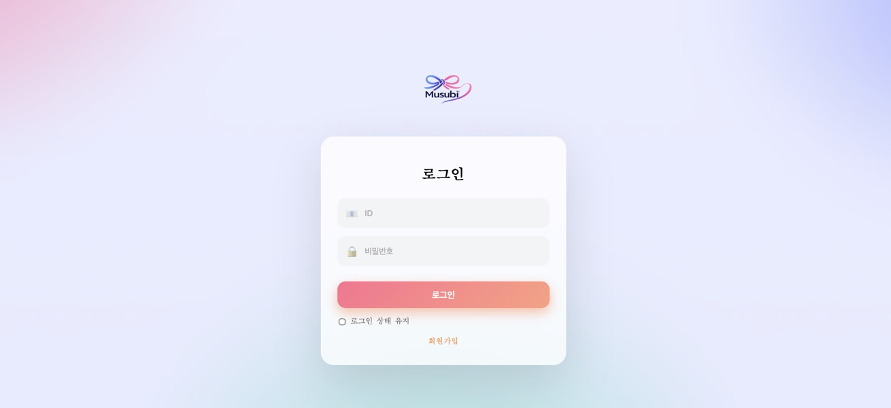

#### 회원가입

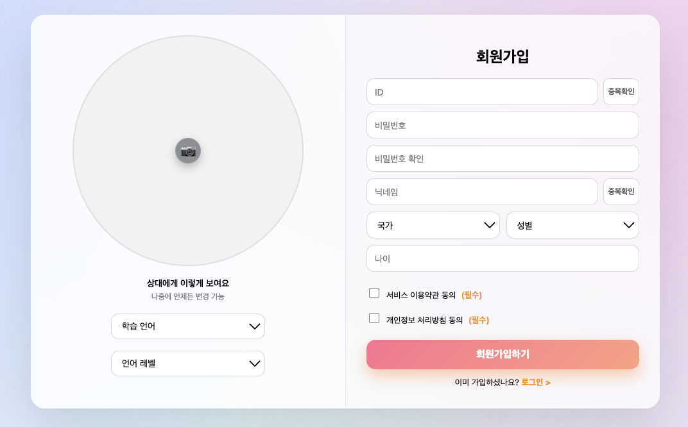

#### 관심사 설정

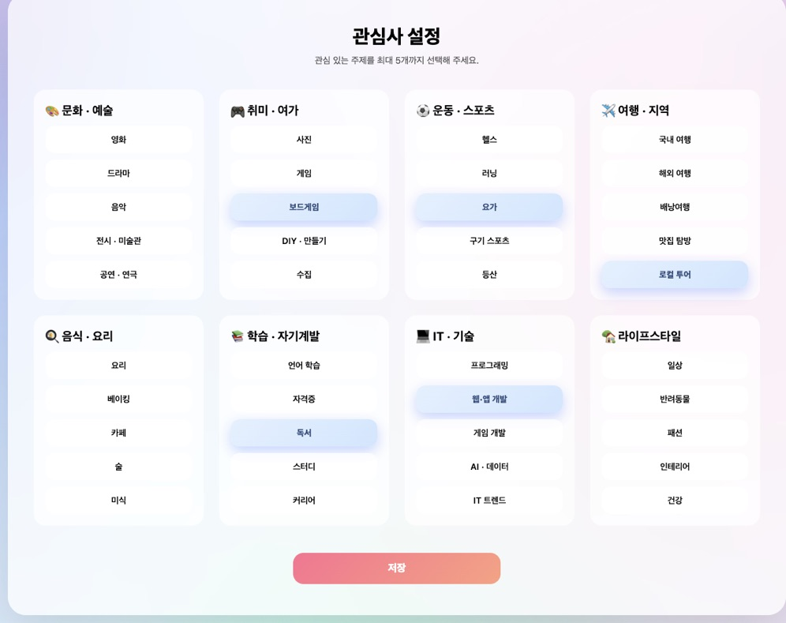

#### 마이페이지

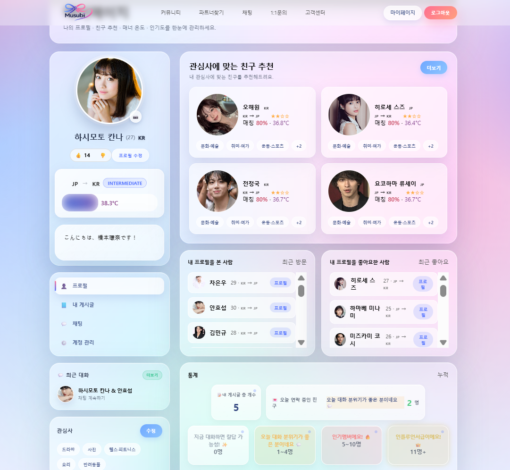

---

### 👤 김한식 (검색, 매칭 시스템)

#### 매칭 페이지

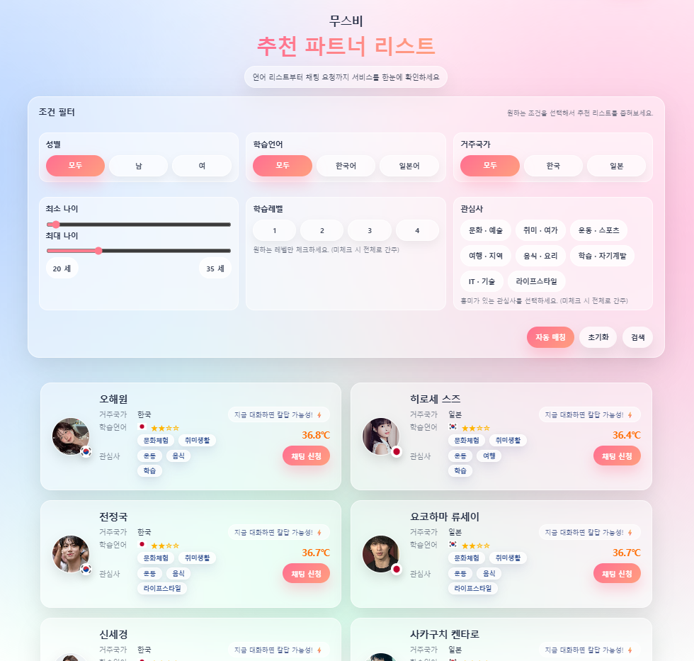

---

### 👤 최근영 (커뮤니티)

#### 커뮤니티 게시판

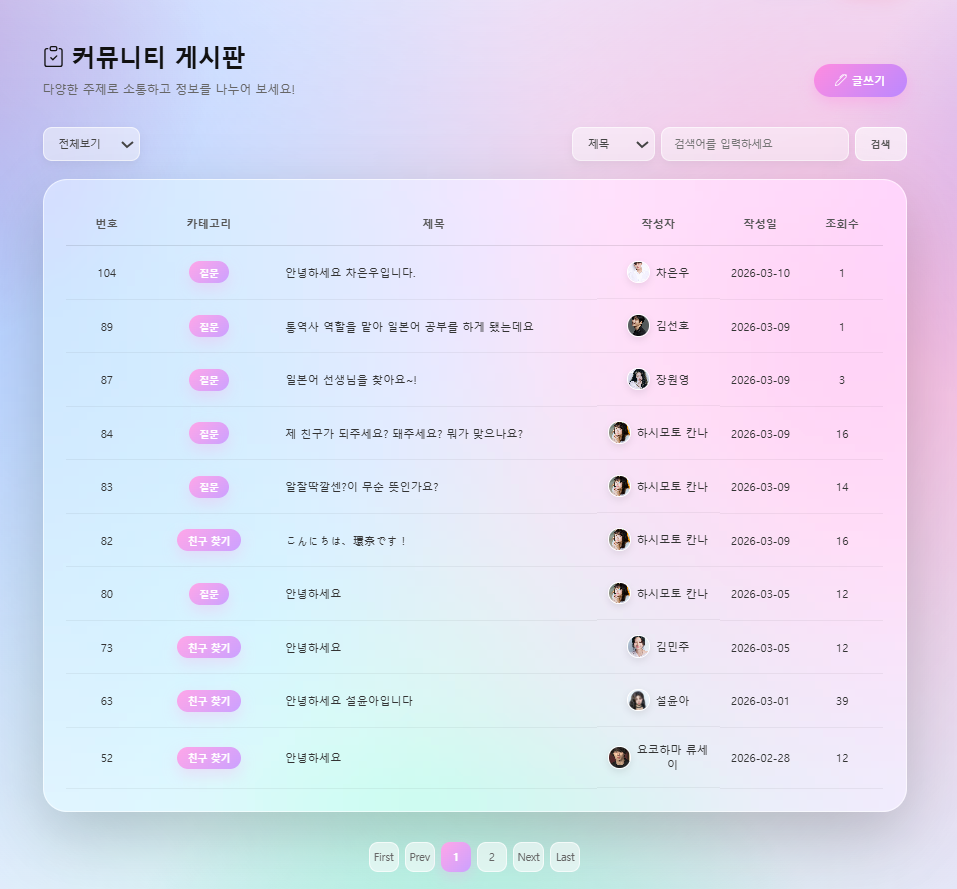

#### 커뮤니티 피드

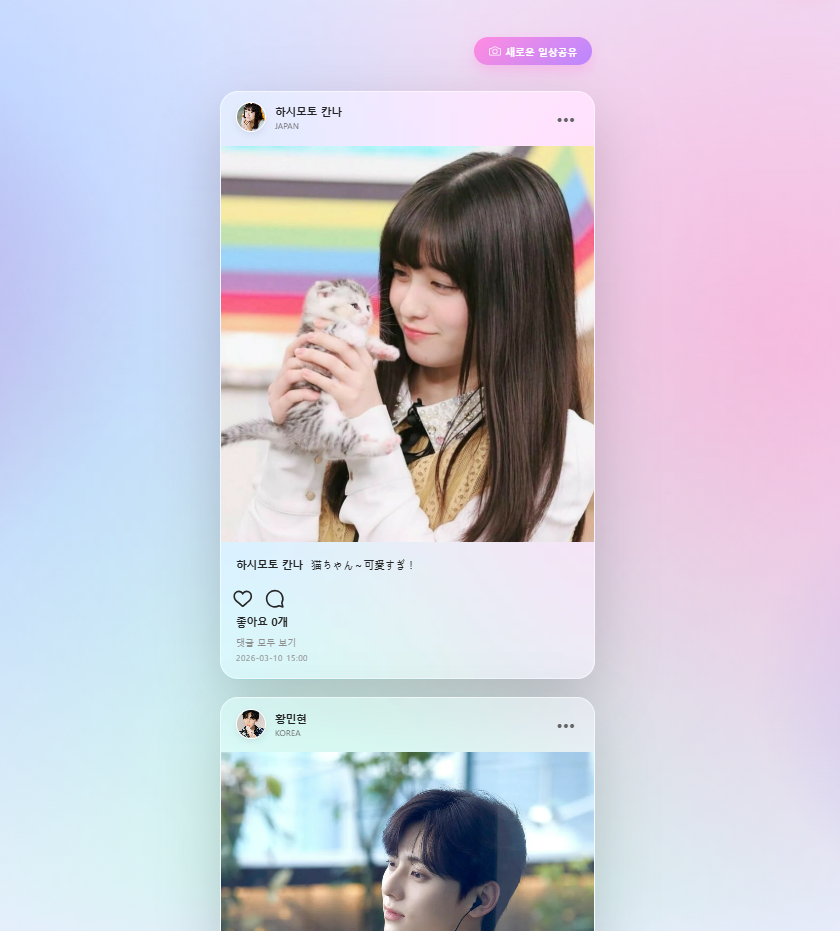

#### 상대 프로필

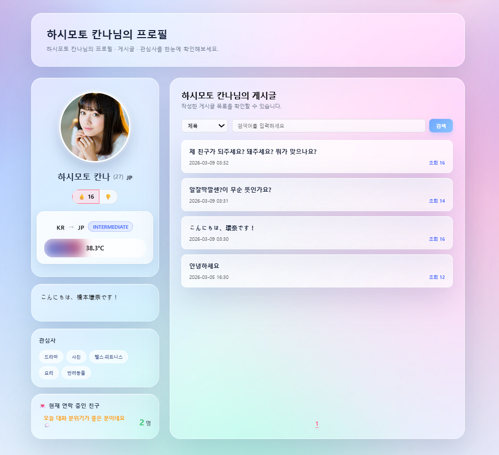

---

### 👤 최동욱 (채팅)

#### 채팅 화면

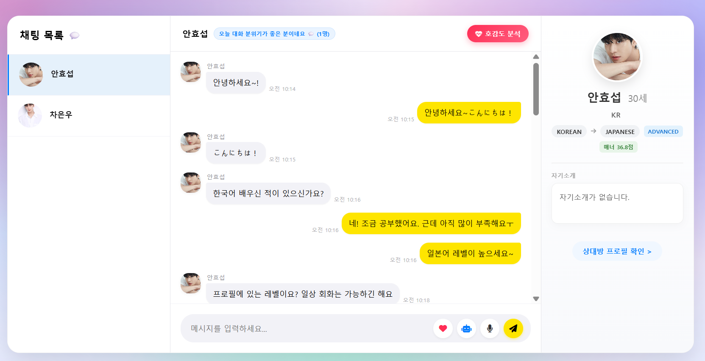

#### 채팅 주요 기능

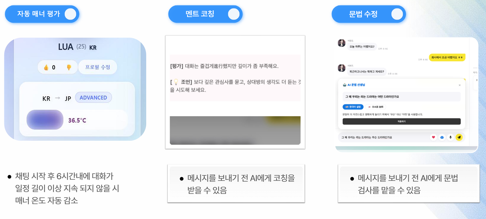

<br/>

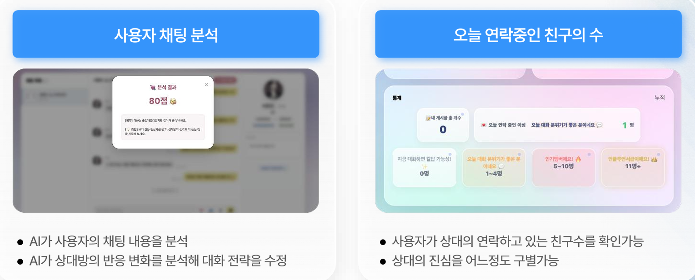

---

### 👤 최민석 (Main / Q&A / 관리자)

#### 메인 구현


#### 1:1 문의

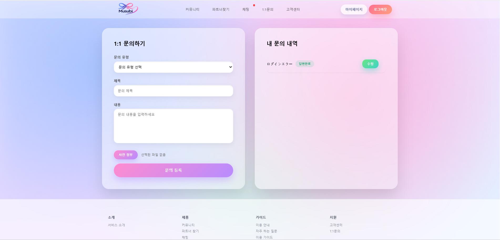

#### 관리자 대시보드

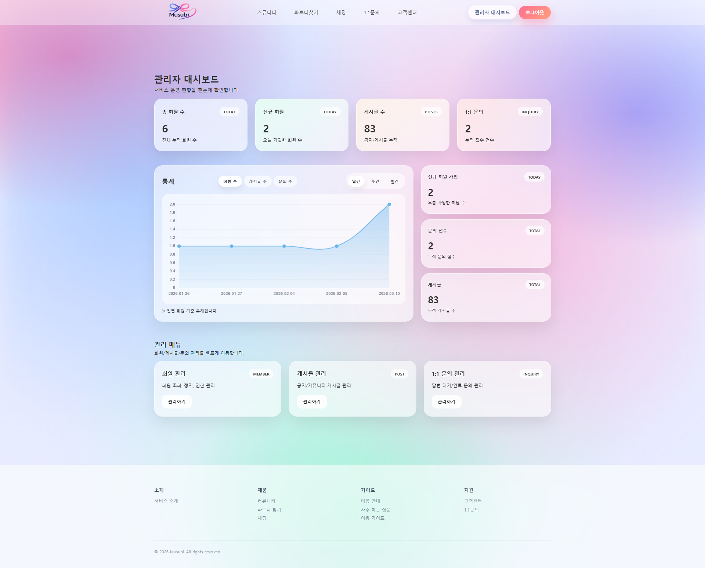

#### 문의 관리

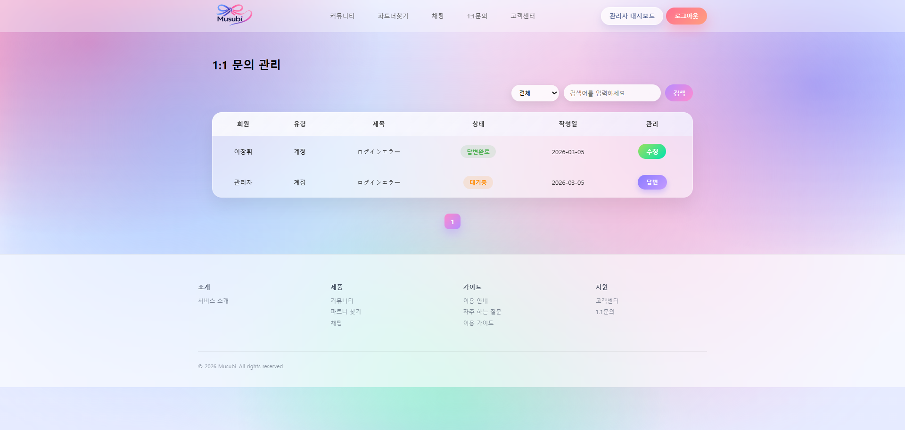

#### 게시글 관리


#### 회원 관리

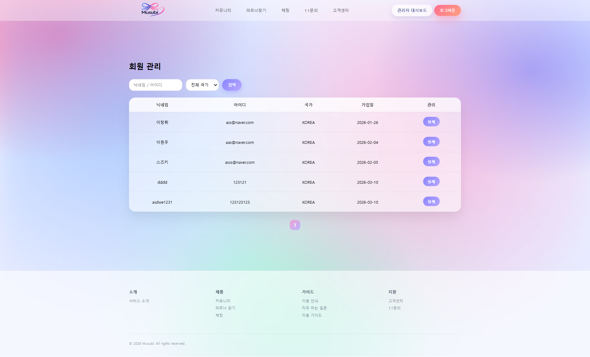
